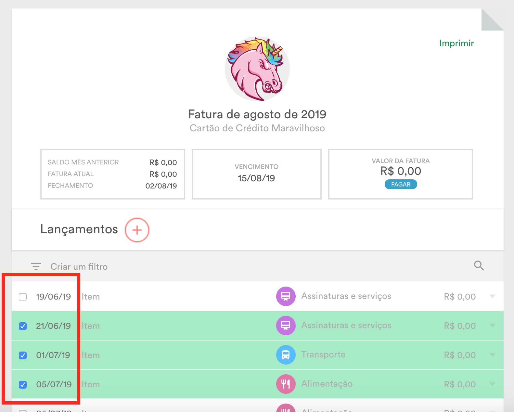

# Conferidor Organizze

Um simples (sério, é muito simples) script que adiciona a função de conferência na tela de lançamento de faturas no [Organizze](https://organizze.com.br).

### Como funciona?

O script adiciona um checkbox em cada item da fatura no canto esquerdo da linha (no lugar do identificador de despesa ou receita). Ao marcar o checkbox a linha fica marcada em verde (sim, eu tenho um péssimo senso de design) e, ao desmarcá-la, a linha volta a cor original.

> Disclaimer: Este script foi desenvolvido por mim e não tem absolutamente nenhuma relação com a aplicação Organizze ou com a empresa que a mantém.
